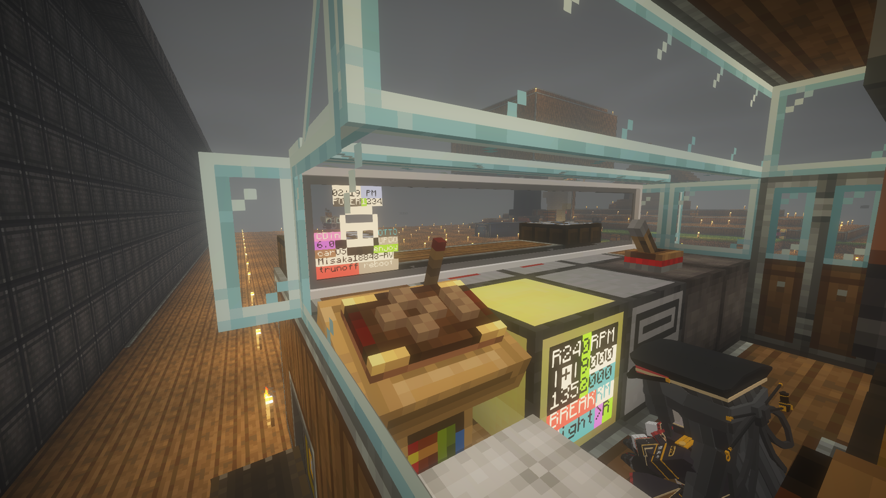
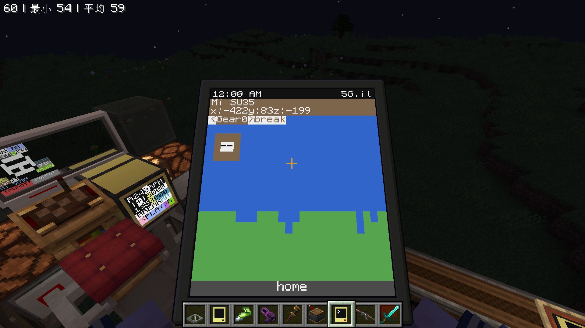

# cc-t-car-control
通过CC电脑使用5档变速在Minecraft里开车。欢迎提交issue和PR，如果觉得这个项目不错，请在右上角点个star。 

Drive your car in Minecraft with 5-speed gear shifting via CC:tweaked. Feel free to submit issues and PRs, and if you like this project, please give me a star. 

  
  

## 需要MOD: 

## Required MODs:  

cc:tweaked 
vs_addition 
void power 
create 
create_addition 
Advanced Peripherals 
trackwork 
clockwork 
valkyrienskies  
## 如何使用: 

## How to Use:  
将startup_pad.lua放在高级无线或者高级末影掌上电脑里，并重命名为startup.lua。 
Place the startup_pad.lua file into the Advanced Wireless or Advanced Ender Pocket Computer and rename it to startup.lua. 
将startup.lua和其他文件放在车上的计算机里。 
Place the startup.lua file and other files in the computer of the car. 
参考lua文件开头注释内容将设备使用有线网络连接上电脑并修改设备名称和方向为你用的设备名称和方向 
Referring to the comment content at the beginning of the Lua file, connect the device to your computer via a wired network connection and modify the device name and orientation to match the name and orientation of the device you are using. 
启动计算机。 
Boot up the computer. 
在电脑的music文件夹里放入格式为.dfpwm的歌即可在开车时听歌（歌曲文件命名只能有英文和数字）。 
Put songs in .dfpwm format into the music folder on your computer to listen to music while driving (song filenames can only contain English letters and numbers). 
